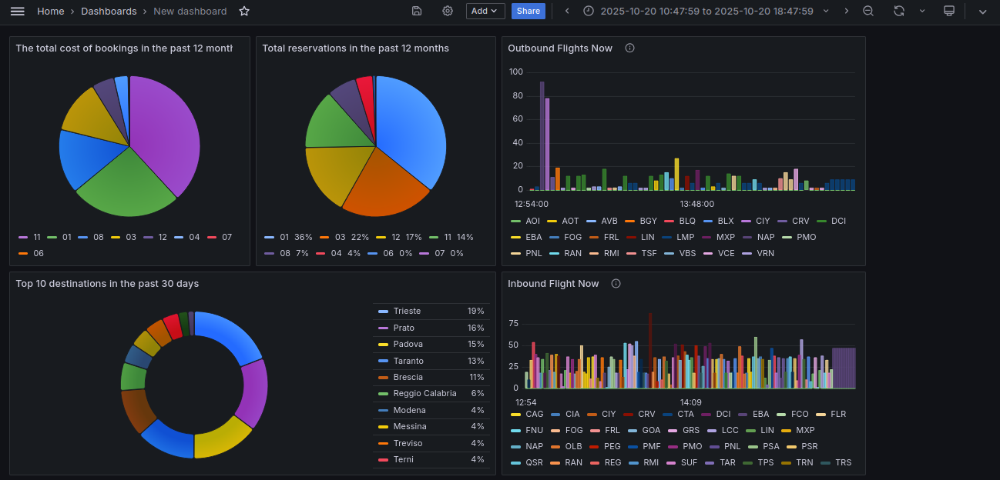
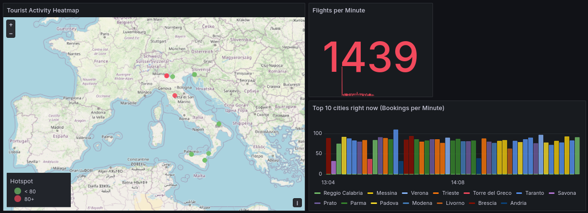
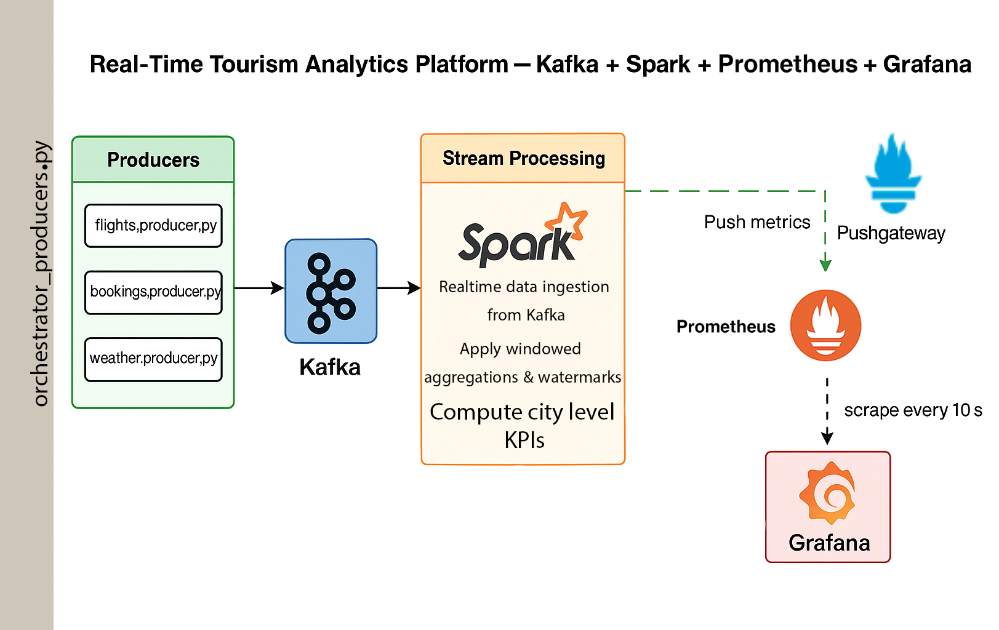
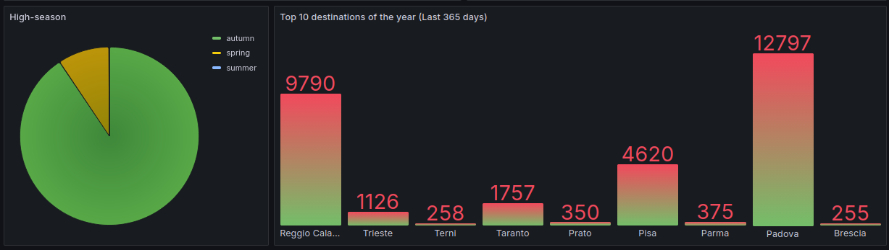

# Real-Time Tourism Analytics Platform (Kafka + Spark + Prometheus + Grafana)

> **End-to-End Data Engineering Project** simulating Italy’s tourism analytics in real-time — from data generation to visualization.







## The Challenge

In the tourism industry, data is generated rapidly from diverse sources — flights, hotel bookings, and weather conditions. However, these data streams are often **isolated**, and analysis happens with significant **delay**.
 City planners, airlines, and hoteliers need **real-time insights** such as:

- Which cities currently attract the most tourists?
- What are the cancellation and delay rates for flights?
- When are the cheapest and least crowded travel periods?

To address these needs, a **real-time data pipeline** was designed to collect, process, and visualize live tourism data.

------

## The Solution

An **end-to-end streaming architecture** was implemented, integrating **Kafka**, **Spark Structured Streaming**, **Prometheus**, and **Grafana**.

- **Kafka** acts as a real-world simulator, generating live event streams:
  - `flight.events.v1` – flight delays, cancellations, and departures
  - `weather.events.v1` – real-time weather conditions
  - `booking.events.v1` – hotel reservations and room prices
- **Spark Structured Streaming** ingests and processes these streams in real time:
  - Cleans and normalizes incoming data
  - Aggregates metrics using time windows (e.g., 1 minute, 30 days, 365 days).
  - Computes KPIs such as flight cancellation rate, average delay, hotel ADR, and total tourism spending

Spark’s **checkpointing**, **watermarking**, and **trigger mechanisms** ensure reliability and true streaming behavior even under network delays or data lags.

------

## Architecture

### 🔸 Components

- **Kafka** – Event streaming backbone
- **Python Producers** – Generate `flights`, `bookings`, `weather` events
- **Spark Structured Streaming** – Clean, join, aggregate streams into KPIs
- **Prometheus + Pushgateway** – Metrics collection from Spark
- **Grafana** – Real-time dashboards (GeoMap, top cities, seasonal trends)




## Results & Impact

The Grafana dashboards transform raw real-time data into **actionable insights** for tourism analytics.
 Each visualization is powered by PromQL queries and custom legends, designed for clarity and fast decision-making across airports, cities, and seasons.

### 1. Airport Inbound & Outbound Traffic (Last 1 Minute)

**Queries:**
 `tourism_airport_flights_per_min{direction="inbound"}` and `tourism_airport_flights_per_min{direction="outbound"}`
 (aggregated using `sum without (instance, job)` and `topk(10)`)

**Purpose:**
 These horizontal bar charts highlight the **top 10 busiest airports** for incoming and outgoing flights over the last minute.
 They help operators quickly identify **traffic peaks**, **bottlenecks**, or **airport congestion** in real time.

**Example Use:**

- Airlines can dynamically allocate staff or gates based on current load.
- Tourism boards can track which cities are seeing sudden tourist inflows.

------

### 2. Total Flights per Minute (Stat Panel)

**Query:**
 `sum without (instance, job) (tourism_flights_total_per_min)`

**Purpose:**
 A simple **stat widget** showing the **total number of active flights per minute**, refreshed live.
 It serves as a **health indicator** for the entire flight data stream — any sudden drop indicates a reporting delay or event disruption.

------

### 3. City Booking Leaderboards

**Queries:**

- `tourism_city_bookings_top{period="1m"}` → last minute
- `tourism_city_bookings_top{period="30d"}` → last 30 days
- `tourism_city_bookings_top{period="365d"}` → last year

**Purpose:**
 These leaderboards display the **top 10 cities** by hotel bookings in different timeframes.
 Comparing 1-minute, 30-day, and 365-day views enables detection of **short-term surges** and **long-term travel trends**.

**Example Use:**

- Detect emerging tourist destinations (“sudden spikes”).
- Support marketing teams in **seasonal campaign planning**.
- Help hotel networks optimize pricing or staffing per city.

------

### 4. Real-Time Booking Heatmap (Geomap)

**Query:**

```
sum by (city_id, city_name, lat, lon) (tourism_city_bookings_geo)
```

**Purpose:**
 Plots each city as a live data point on the map, sized and colored by booking volume.
 It reveals **spatial patterns** in tourism activity — such as regional concentration or demand shifts — updated continuously.

**Example Use:**

- Detect live tourism “hotspots” in Italy.
- Support **dynamic ad targeting** or **local event planning**.
- Monitor **impact of weather** or flight delays on regional booking distribution.

------

### 5. Monthly & Seasonal Rolling Trends

**Queries:**

- `tourism_month_bookings_rolling` → monthly booking rhythm
- `tourism_month_spend_rolling_eur` → monthly spending pattern
- `tourism_season_bookings_rolling` → bookings by season
- `tourism_season_spend_rolling_eur` → spending by season

**Purpose:**
 These bar and pie charts show **rolling 12-month and seasonal trends** in bookings and spending.
 They quantify **tourism seasonality**, helping to pinpoint the most and least profitable times of year.

**Example Use:**

- Estimate **high-season vs. off-season** performance.
- Correlate **weather and pricing** with tourist demand.
- Power the **Tourism Season Score** metric for data-driven travel recommendations.



------

### Why It Matters

Together, these dashboards turn continuous event streams into a **live tourism intelligence platform**:

| Stakeholder                | Value Gained                                                 |
| -------------------------- | ------------------------------------------------------------ |
| **City Planners**          | Real-time visibility of tourism density and infrastructure load |
| **Airlines & Airports**    | Instant awareness of flight congestion and passenger flow    |
| **Hotels & Agencies**      | Live demand indicators for dynamic pricing and promotions    |
| **Researchers & Analysts** | Historical and live data for modeling travel patterns        |

By combining **Prometheus metrics**, **Grafana visualization**, and **Spark streaming analytics**, the system delivers **continuous situational awareness** — enabling faster, data-driven decisions across the tourism ecosystem.


## ⚙️ Setup & Installation

### 1️⃣ Environment

```
python3 -m venv ~/myenvs/tourism
source ~/myenvs/tourism/bin/activate
pip install -r requirements.txt
```

### 2️⃣ Kafka (KRaft Mode)

```
cd ~/tools/confluent-8.0.2
bin/kafka-storage.sh format -t $(bin/kafka-storage.sh random-uuid) -c etc/kafka/server.properties
bin/kafka-server-start.sh etc/kafka/server.properties
```

### 3️⃣ Create Topics

```
for t in flight.events.v1 booking.events.v1 weather.events.v1; do
  bin/kafka-topics.sh --bootstrap-server localhost:9092 \
  --create --topic "$t" --partitions 1 --replication-factor 1
done
```

## Data Producers

`producers/orchestrator_producers.py` generates synthetic events for:

- **Flights:** delays, cancellations, load factor
- **Bookings:** ADR proxy, lead time, channels
- **Weather:** temperature, precipitation, condition

### Example Run

```
python producers/orchestrator_producers.py \
  --mode timewarp \
  --sim-start 2023-01-01 \
  --days 30 \
  --timewarp 500 \
  --bootstrap-servers localhost:9092 \
  --sample-cities 15 \
  --sample-airports 5 \
  --sample-hotels 300

```

✅ Output example:

```
[2025-10-19] produced: weather=495 flights=381 bookings=119
```


## Real-Time Processing (Spark Structured Streaming)

- Reads from Kafka topics
- Cleans and enriches data
- Aggregates into **city-day KPIs**
- Pushes metrics to **Prometheus → Grafana**

### Run Spark Job

```
$SPARK_HOME/bin/spark-submit \
  --packages org.apache.spark:spark-sql-kafka-0-10_2.13:4.0.1 \
  spark/kafka_to_metrics.py
```

## 📊 Monitoring Stack

### Prometheus + Pushgateway

```
./pushgateway --web.listen-address=":9091" &
./prometheus --config.file=prometheus.yml --web.listen-address=":9090" &
```

### Grafana

```
sudo systemctl start grafana-server
# UI: http://localhost:3000 (admin / admin)
```

Add Prometheus as data source → `http://localhost:9090`

------

## Highlights

- **Full Data Lifecycle:** generation → ingestion → processing → visualization
- **Watermark + Windowing:** reliable time-based aggregations
- **Prometheus integration:** real-time KPI monitoring
- **Config-driven Producers:** flexible city/hotel parameters
- **Scalable architecture:** modular, reproducible, container-ready

------

## Future Work

- Implement Schema Registry (Avro / JSON Schema)
- Add CI/CD with GitHub Actions
- Expand producer logic (hourly / weekly granularities)
- Publish Dockerized version of entire stack

------

## 🧰 Tech Stack

| Category          | Tools                    |
| ----------------- | ------------------------ |
| Stream Processing | Kafka / Redpanda / Spark |
| Monitoring        | Prometheus / Pushgateway |
| Visualization     | Grafana                  |
| Language          | Python 3.10+             |
| Infrastructure    | Ubuntu                   |

------

## 📎 Project Structure

```
Projects/Tourism/
│
├── scripts/                            # Data cleaning & ETL scripts
│   ├── build_hotels_yaml.py            # Generate hotels.yaml config from cleaned hotel data
│   ├── clean_airports_it.py            # Filter & clean Italian airports dataset (OurAirports)
│   ├── clean_cities_geonames.py        # Extract and clean GeoNames city data for Italy
│   ├── clean_istat_abitazioni.py       # Clean ISTAT housing dataset (Abitazioni)
│   ├── clean_istat_commuting.py        # Clean ISTAT commuting dataset (Commuting ratios)
│   ├── clean_istat_famiglie.py         # Clean ISTAT families-by-size dataset
│   ├── extract_households_population.py# Extract population and household data (ISTAT)
│   ├── final_cleaning.py               # Final sanity checks and unified output cleanup
│   ├── istat_utils.py                  # Shared helper functions for ISTAT datasets
│   ├── merge_cities_all.py             # Merge all cleaned datasets into enriched city reference
│   ├── merge_istat_cities.py           # Intermediate merge step (ISTAT ↔ GeoNames cities)
│   ├── peek_istr_lav.py                # Lightweight inspection of ISTAT columns/index codes
│   └── rebuild_and_merge_cities_it.py  # Rebuild full city dataset and re-merge clean data
│
├── producers/                          # Event generators (Kafka)
│   └── orchestrator_producers.py       # Unified producer for flights, bookings, weather
│
├── spark/								# Streaming and batch analytics
│   └── kafka_to_metrics.py
│
├── Dataset/
│
├── data/
│   └── curated/
│       ├── airports_it.csv
│       ├── hotels_clean.csv
│       └── cities_it_enriched_full.csv 
├── Demo/
│
└──requirements.txt
    

```

------

## 🧭 Author

**Navid Tavakoli Shalmani**
 Data Engineer | Environmental Data Specialist
 🌐 navidtavakolishalmani.com
 📧 navid.tavakoli.sh@gmail.com
 🔗 [LinkedIn](https://www.linkedin.com/in/navid-tavakoli-shalmani/) | [GitHub](https://github.com/navidtavakoli)
