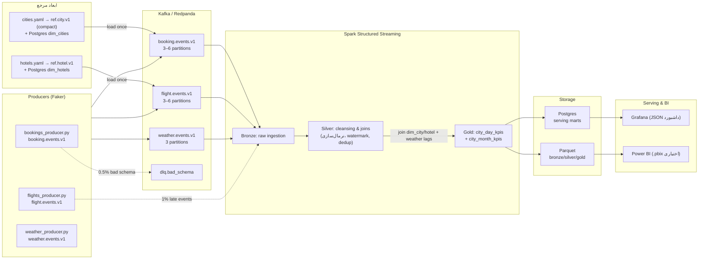

# Tourism Trends (Italy)

Pipeline هدف: **Kafka → Spark (batch/stream) → Parquet/Postgres → Grafana/Power BI**
 دادهٔ فیک اما **مبتنی بر واقعیت** (شهر/فرودگاه/هتل واقعی؛ وزن‌دهی با جمعیت/فصل/آب‌وهوا).

## 1.Python venv & پایه‌ها (بدون Docker)

```
python3 -m venv ~/myenvironments/Tourism
source ~/myenvironments/Tourism/bin/activate
pip install --upgrade pip

# Python libs (تولید داده + ETL + ذخیره + مصورسازی)
pip install faker pyyaml pandas numpy kafka-python pyarrow psycopg2-binary matplotlib jupyter rapidfuzz

# (اختیاری برای parquet سریع‌تر)
pip install fastparquet

# Postgres (محلی)
sudo apt update
sudo apt install -y postgresql postgresql-contrib

```

ابزارهای CLI مفید:

```
sudo apt install -y csvkit        # کار با CSV از خط فرمان
sudo apt install -y gdal-bin      # ابزارهای جغرافیایی (ogr2ogr و ...)
sudo apt install -y osmium-tool   # استخراج OSM/هتل‌ها از PBF

```

## 2) Grafana (سیستم‌عامل Debian/Ubuntu)

```
wget https://dl.grafana.com/oss/release/grafana_10.4.2_amd64.deb
sudo apt install -y musl           # dependency
sudo dpkg -i grafana_10.4.2_amd64.deb
rm grafana_10.4.2_amd64.deb

sudo systemctl enable grafana-server
sudo systemctl start grafana-server
# login: http://127.0.0.1:3000 (default: admin / admin)

```

## 3) ساختار پروژه

```
Projects/Tourism/
├─ scripts/
│  ├─ clean_airports_it.py
│  ├─ clean_cities_geonames.py
│  ├─ extract_households_population.py
│  ├─ istat_utils.py
│  ├─ clean_istat_abitazioni.py
│  ├─ clean_istat_famiglie.py
│  ├─ peek_istr_lav.py
│  ├─ clean_istat_commuting.py
│  ├─ merge_cities_with_households.py
│  ├─ name_utils.py
│  └─ merge_cities_all.py
├─ Dataset/                 # فایل‌های خام (OurAirports, GeoNames, ISTAT, OSM PBF)
└─ data/
   └─ curated/             # خروجی‌های تمیز و گزارش‌ها
      └─ reports/

```

## 4) دیتاست‌های مرجع و پاک‌سازی

### 4.1 OurAirports → `airports_it.csv`

- **هدف:** فقط فرودگاه‌های ایتالیا با IATA سه‌حرفی و مختصات معتبر.
- ورودی: `Dataset/airports.csv` (خام OurAirports)
- خروجی: `data/curated/airports_it.csv`


```
mkdir -p data/curated
python scripts/clean_airports_it.py /path/to/airports.csv
# چک:
python - <<'PY'
import pandas as pd
df = pd.read_csv("data/curated/airports_it.csv")
print(df.shape, df.head().to_string(index=False))
PY

```

**ستون‌ها:** `airport_code, icao_code, name, type, lat, lon, city_name, region_code, ident`
 **Dedup:** اگر IATA تکراری بود → `large_airport` > `medium` > `small`.


### 4.2 GeoNames (IT.txt) → `cities_it.csv`

- **هدف:** همهٔ شهرها/آبادی‌ها (feature_class='P') با مختصات و جمعیت.
- ورودی: `data/raw/geonames/IT.txt` (از GeoNames)
- خروجی: `data/curated/cities_it.csv`

```
python scripts/clean_cities_geonames.py /path/to/IT.txt
```

**ستون‌ها:** `city_id, city_name, admin1_code, region, lat, lon, population`


### 4.3 ISTAT — Households & Population (پایه)

- **Households:** از `DCSS_FAM_POP` (شاخص `NPHH_AV`)
- **Population (اختیاری):** از `DCSS_POP_DEMCITMIG` (شاخص `RESPOP_AV` یا `RESPOP_MIN_AV`)
- خروجی‌ها:
  - `data/curated/istat_households.csv` → `territory_code, territory_name, year, households`
  - `data/curated/istat_population.csv` → `territory_code, territory_name, year, population` (اگر سیستم اجازه داد)

```
python scripts/extract_households_population.py
```

> *نکته:* فایل‌های ISTAT حجیم و گاهی با `|`/`;` هستند. `istat_utils.py` خواندن مقاوم با تشخیص جداکننده/کوتیشن را انجام می‌دهد.


### 4.4 ISTAT — Abitazioni (Homes) → `istat_homes.csv`

- ورودی: `DCSS_ABITAZIONI`
- شاخص‌ها: `NUM_DW_AV` (کل واحد مسکونی)، `NUM_OCC_DW_AV` (اشغال‌شده)
- خروجی: `territory_name, dwellings_total, dwellings_occupied, occupied_share`

```
python scripts/clean_istat_abitazioni.py
```


### 4.5 ISTAT — Famiglie (Families by size) → `istat_families.csv`

- ورودی: `DCSS_FAMIGLIE`
- خروجی: `families_total, families_3plus_share, avg_family_size_from_istat`

```
python scripts/clean_istat_famiglie.py
```


### 4.6 ISTAT — Istruzione/Lavoro/Commuting → `istat_commuting.csv`

- ورودی: `DCSS_ISTR_LAV_PEN_2`
- شاخص‌ها در فایل شما: `RESPOP_AV`, `RP_COM_DAY`
- خروجی: `resident_population, commuting_population, commuting_ratio`

```
python scripts/peek_istr_lav.py      # تشخیص ستون‌ها/کد شاخص‌ها (سبُک)
python scripts/clean_istat_commuting.py
```


## 5) ادغام مرجع‌های شهری

### 5.1 Merge ساده (households فقط) → `cities_it_enriched.csv`

```
python scripts/merge_cities_with_households.py
```

**ستون‌ها:** `city_id, city_name, region, lat, lon, population, households, avg_family_size`

- `avg_family_size` = `population / households` (fallback)

### 5.2 Merge کامل → `cities_it_enriched_full.csv`

ادغام `cities_it.csv` با همهٔ خروجی‌های ISTAT (households, homes, families, commuting).

```
python scripts/merge_cities_all.py
```

خروجی: `data/curated/cities_it_enriched_full.csv`
 گزارش unmatched: `data/curated/reports/unmatched_top500.csv`


## 6) نکات کیفیت و عیب‌یابی

- **ISTAT CSV‌ها خراب/Quote ناهمگون:** در utilها از `quoting=QUOTE_NONE`, `on_bad_lines='skip'`, و تشخیص خودکار `sep` استفاده شده.
- **نام ستون‌ها:** با `find_col` به صورت **case-insensitive** و ضد فاصله/Quote پیدا می‌شن.
- **سال:** اگر ستون `TIME` قالب غیرعددی داشت (مثل «Censimento 2021»)، سال با regex استخراج می‌شه.
- **Chunking:** برای فایل‌های چندگیگی، همهٔ readerها chunkی هستن (`chunksize=100k–150k`).


## 7) آنچه آمادهٔ مصرف Producerهاست

- `data/curated/airports_it.csv` → مرجع فرودگاه‌ها (IATA + lat/lon)
- `data/curated/cities_it.csv` → همهٔ شهرها/آبادی‌ها با جمعیت/مختصات
- `data/curated/cities_it_enriched_full.csv` → مرجع شهری غنی‌شده با:
  - `households, avg_family_size`
  - `dwellings_total, occupied_share`
  - `families_total, families_3plus_share, avg_family_size_from_istat`
  - `resident_population_istat, commuting_population, commuting_ratio`

> این فایل برای وزن‌دهی تقاضا، seasonality city-level، و نقشهٔ Grafana (Geo map) کاملاً مناسب است.


## 8) قدم‌های بعدی (Outline)

- `configs/cities.yaml` و `configs/dist_params.yaml` را از `cities_it_enriched_full.csv` بسازیم (peak_months, weekday_weight, coastal_flag…).
- OSM → استخراج هتل‌های واقعی (name + lat/lon + stars اگر موجود) → `configs/hotels.yaml`.
- سه Producer:
  - `producers/bookings_producer.py`
  - `producers/flights_producer.py`
  - `producers/weather_producer.py`
- Spark:
  - `spark/streaming_city_kpis.py` (Structured Streaming → gold city_day_kpis)
  - `spark/batch_monthly_rollup.py`
- Grafana:
  - داشبورد realtime (consumer lag, msgs/sec, arrivals_today, cancel_rate, ADR proxy, map)


حالا می‌تونیم همهٔ دیتاست‌های تمیزشده رو یک‌جا “مرجع شهرها” کنیم تا Producerها مستقیم ازش بخونن.

## هدف این مرحله

ساخت فایل نهایی:

```
data/curated/cities_it_enriched_full.csv
```

با ستون‌های کلیدی:

- `city_id, city_name, region, lat, lon, population` (از GeoNames)
- `households, avg_family_size`
- `dwellings_total, dwellings_occupied, occupied_share`
- `families_total, families_3plus_share, avg_family_size_from_istat`
- `resident_population_istat, commuting_population, commuting_ratio`

> چون فایل‌های ISTAT کد «کُمونه» (`territory_code` مثل 001001) دارند ولی `cities_it.csv` از GeoNames فاقد این کده، merge را **نام‌محور** (normalize name) انجام می‌دیم و گزارش unmatched هم تولید می‌کنیم.


## 1) ابزار نرمال‌سازی نام‌ها (اگر قبلاً نداری)

```
scripts/name_utils.py
#!/usr/bin/env python3
import re, unicodedata
import pandas as pd

def norm_text(s: str) -> str:
    if pd.isna(s): return ""
    s = s.strip().lower()
    s = "".join(c for c in unicodedata.normalize("NFKD", s) if not unicodedata.combining(c))
    s = re.sub(r"[’'`]", "", s)        # حذف اپوستروف
    s = re.sub(r"[^a-z0-9]+", " ", s) # فقط حروف/اعداد
    return s.strip()

def clean_istat_name(s: str) -> str:
    s = norm_text(s)
    # حذف پیشوندهای اداری رایج
    patterns = [
        r"^comune di ", r"^citta metropolitana di ", r"^provincia di ",
        r"^unione dei comuni .*? ", r"^territorio di ", r"^municipio di ",
        r"^regione .*? ", r"^zona .*? ", r"^ambito .*? "
    ]
    for p in patterns:
        s = re.sub(p, "", s)
    return s.strip()
```

------

## 2) مرج نهایی همهٔ دیتاست‌ها

```
scripts/merge_cities_all.py
#!/usr/bin/env python3
import os, pandas as pd
from name_utils import norm_text, clean_istat_name

BASE = "/home/tahmast/Projects/Tourism"
CUR = os.path.join(BASE, "data/curated")

# ورودی‌ها
CITIES = os.path.join(CUR, "cities_it.csv")                   # GeoNames: city_id, city_name, region, lat, lon, population
HH     = os.path.join(CUR, "istat_households.csv")            # territory_name, households
HOMES  = os.path.join(CUR, "istat_homes.csv")                 # territory_name, dwellings_total, dwellings_occupied, occupied_share
FAMS   = os.path.join(CUR, "istat_families.csv")              # territory_name, families_total, families_3plus_share, avg_family_size_from_istat
COMM   = os.path.join(CUR, "istat_commuting.csv")             # territory_name, resident_population, commuting_population, commuting_ratio

OUT    = os.path.join(CUR, "cities_it_enriched_full.csv")
REPORT = os.path.join(CUR, "reports")
os.makedirs(REPORT, exist_ok=True)

def load_or_empty(path):
    if not os.path.exists(path):
        return pd.DataFrame()
    return pd.read_csv(path, dtype=str)

def norm_df(df, name_col):
    if name_col in df.columns:
        df[name_col+"_norm"] = df[name_col].map(clean_istat_name)
    return df

def main():
    # 1) GeoNames cities
    cities = pd.read_csv(CITIES, dtype=str)
    # انواع عددی
    for col in ("lat","lon","population"):
        if col in cities.columns:
            cities[col] = pd.to_numeric(cities[col], errors="coerce")
    cities["city_name_norm"] = cities["city_name"].map(norm_text)

    # 2) ISTAT datasets
    hh   = norm_df(load_or_empty(HH),   "territory_name")
    homes= norm_df(load_or_empty(HOMES),"territory_name")
    fams = norm_df(load_or_empty(FAMS), "territory_name")
    comm = norm_df(load_or_empty(COMM), "territory_name")

    # تبدیل اعداد
    if "households" in hh.columns:
        hh["households"] = pd.to_numeric(hh["households"], errors="coerce")
        hh = hh.groupby("territory_name_norm", as_index=False)["households"].max()

    if {"dwellings_total","dwellings_occupied","occupied_share"}.issubset(homes.columns):
        homes["dwellings_total"]    = pd.to_numeric(homes["dwellings_total"], errors="coerce")
        homes["dwellings_occupied"] = pd.to_numeric(homes["dwellings_occupied"], errors="coerce")
        homes["occupied_share"]     = pd.to_numeric(homes["occupied_share"], errors="coerce")
        homes = homes.groupby("territory_name_norm", as_index=False).agg({
            "dwellings_total":"max","dwellings_occupied":"max","occupied_share":"max"
        })

    if {"families_total","families_3plus_share","avg_family_size_from_istat"}.issubset(fams.columns):
        fams["families_total"] = pd.to_numeric(fams["families_total"], errors="coerce")
        fams["families_3plus_share"] = pd.to_numeric(fams["families_3plus_share"], errors="coerce")
        fams["avg_family_size_from_istat"] = pd.to_numeric(fams["avg_family_size_from_istat"], errors="coerce")
        fams = fams.groupby("territory_name_norm", as_index=False).agg({
            "families_total":"max","families_3plus_share":"max","avg_family_size_from_istat":"max"
        })

    if {"resident_population","commuting_population","commuting_ratio"}.issubset(comm.columns):
        comm["resident_population"]  = pd.to_numeric(comm["resident_population"], errors="coerce")
        comm["commuting_population"] = pd.to_numeric(comm["commuting_population"], errors="coerce")
        comm["commuting_ratio"]      = pd.to_numeric(comm["commuting_ratio"], errors="coerce")
        comm = comm.groupby("territory_name_norm", as_index=False).agg({
            "resident_population":"max","commuting_population":"max","commuting_ratio":"max"
        })
        # اسم ستون‌ها را واضح‌تر کنیم
        comm = comm.rename(columns={
            "resident_population":"resident_population_istat"
        })

    # 3) مرج نام‌محور (left) با گزارش unmatched
    merged = cities.copy()
    # households
    if not hh.empty:
        merged = merged.merge(hh, left_on="city_name_norm", right_on="territory_name_norm", how="left")
        merged = merged.drop(columns=["territory_name_norm"], errors="ignore")
    # homes
    if not homes.empty:
        merged = merged.merge(homes, left_on="city_name_norm", right_on="territory_name_norm", how="left")
        merged = merged.drop(columns=["territory_name_norm"], errors="ignore")
    # families
    if not fams.empty:
        merged = merged.merge(fams, left_on="city_name_norm", right_on="territory_name_norm", how="left")
        merged = merged.drop(columns=["territory_name_norm"], errors="ignore")
    # commuting
    if not comm.empty:
        merged = merged.merge(comm, left_on="city_name_norm", right_on="territory_name_norm", how="left")
        merged = merged.drop(columns=["territory_name_norm"], errors="ignore")

    # 4) محاسبات کمکی
    # avg_family_size (fallback): population / households
    if "households" in merged.columns:
        merged["avg_family_size"] = (merged["population"] / merged["households"]).where(merged["households"]>0)

    # 5) خروجی نهایی
    out_cols = [
        "city_id","city_name","region","lat","lon","population",
        "households","avg_family_size","families_total","families_3plus_share","avg_family_size_from_istat",
        "dwellings_total","dwellings_occupied","occupied_share",
        "resident_population_istat","commuting_population","commuting_ratio"
    ]
    for c in out_cols:
        if c not in merged.columns: merged[c] = pd.NA

    merged[out_cols].to_csv(OUT, index=False)
    print(f"✓ Saved: {OUT}  rows={len(merged)}")

    # گزارش unmatched‌های مهم (شهرهای پرجمعیت که household ندارند)
    rep = merged[merged["households"].isna()][["city_id","city_name","region","population"]].copy()
    rep = rep.sort_values("population", ascending=False).head(500)
    rep_path = os.path.join(REPORT, "unmatched_top500.csv")
    rep.to_csv(rep_path, index=False)
    print(f"↪ unmatched report: {rep_path}  rows={len(rep)}")

if __name__ == "__main__":
    main()
```

### اجرا

```
source ~/myenvironments/Tourism/bin/activate
python /home/tahmast/Projects/Tourism/scripts/merge_cities_all.py
```

**انتظار خروجی:**

- `data/curated/cities_it_enriched_full.csv`
- `data/curated/reports/unmatched_top500.csv`


## بعدش چی؟

- اگر پوشش `households` یا بقیه پایین بود، می‌تونیم یک **لغت‌نامهٔ نگاشت نام** بسازیم (مثال: `{"Reggio nell'Emilia": "Reggio Emilia"}`) و قبل از merge اعمال کنیم تا مچ‌ها زیادتر بشن.
- یا اگر خواستی، مرحلهٔ دوم fuzzy matching (RapidFuzz) فقط برای **top-N شهرهای پرجمعیت unmatched** اضافه می‌کنم.

هر موقع این مرج نهایی ساخته شد، ۵–۱۰ خط اول `cities_it_enriched_full.csv` رو بده؛ بعدش می‌ریم سراغ مرحلهٔ بعدی:
 **ساخت `configs/cities.yaml` و (اختیاری) `configs/hotels.yaml` واقعی** و آماده‌سازی Producerهای Faker (seasonality/weights) 💪


## سناریو

در این سناریو، هدف ساختن یک **Pipeline تحلیلی واقع‌نما برای گردشگری ایتالیا** است که از داده‌های شبه‌واقعی (شهرها، فرودگاه‌ها، هتل‌ها، فصل‌ها، جمعیت و آب‌وهوا) استفاده می‌کند تا جریان داده را از مرحله‌ی تولید تا مصورسازی شبیه‌سازی کند. در این جریان، **سه Producer** داده‌های مربوط به رزرو هتل، پروازها و وضعیت آب‌وهوا را به‌صورت هم‌زمان تولید کرده و از طریق **Kafka** به سیستم منتقل می‌کنند. Kafka به‌عنوان ستون فقرات معماری، مسئول صف‌بندی و پخش مطمئن داده‌ها بین اجزای مختلف است.

در مرحله‌ی بعد، **Apache Spark** (هم در حالت استریم و هم Batch) این داده‌ها را پردازش کرده، رویدادهای مرتبط را بر اساس شهر و زمان ترکیب و پاک‌سازی می‌کند و شاخص‌هایی مانند نرخ اشغال، لغو، میانگین قیمت و تقاضای گردشگر را محاسبه می‌کند. خروجی‌ها به‌صورت **Parquet** (برای تحلیل‌های سنگین و نگه‌داری بلندمدت) و هم‌زمان در **PostgreSQL** (برای سرو سریع به داشبوردها) ذخیره می‌شوند. در پایان، **Grafana** و **Power BI** با اتصال به Postgres یا فایل‌های Parquet، داشبوردهای زنده و گزارش‌های تحلیلی ارائه می‌دهند تا مدیران بتوانند روند گردشگری، فصل‌های پرترافیک و عملکرد مناطق مختلف را در لحظه ببینند.

این معماری در واقع شبیه‌سازی کوچکی از یک **سیستم داده‌محور در مقیاس واقعی** است؛ از تولید داده تا پردازش، ذخیره‌سازی و مصورسازی — همه در یک چرخه‌ی کامل و بهینه.




## 1) ورودی‌های مرجع (Static/Curated)

- **`cities_it_enriched_full.csv`** + کانفیگ‌ها (`configs/*.yaml`): شهرها/فرودگاه‌ها/هتل‌های واقعی، با وزن‌دهی جمعیت، فصل، آب‌وهوا، نسبت commute و…
- این‌ها «پارامترهای واقع‌نما» را به Producerها می‌دهند تا دادهٔ فیک ولی معتبر بسازند.

## 2) Producers (تولید جریان رویداد)

- **`flights_producer`**: پروازها و رویدادهای پروازی (arrival, delay, cancel) را طبق فصل/شهر/فرودگاه تولید و به تاپیک **`flights`** می‌فرستد.
- **`bookings_producer`**: رزرو هتل (check-in/out، ADR proxy، تعداد میهمان، کانال فروش) را به **`bookings`** می‌فرستد.
- **`weather_producer`**: آب‌وهوا (دما/بارش/شرایط) هم‌تراز با شهر/تاریخ را به **`weather`** می‌فرستد.
- همه با **کدگذاری سازگار (JSON/Avro)** و **کلیدهای پایدار** (مثل `city_id|date` یا `iata+ts`) تا بعداً join/aggregation پایدار انجام شود.

## 3) Kafka (لایه استریم)

- سه **Topic**‌: `flights`, `bookings`, `weather` با پارتیشن‌بندی مبتنی بر کلید شهر/تاریخ → **مقیاس‌پذیری** و **ترتیب نسبی**.
- نگهداری مناسب **retention** برای بازپخش (replay) و **consumer group** برای استریم‌ها.

## 4) Spark Processing (Streaming + Batch)

- **Streaming Job (`spark/streaming_city_kpis.py`)**
  - مصرف سه تاپیک و **join با پنجرهٔ زمانی** (event-time) + **Watermark** برای رویدادهای دیررس.
  - **Dedup** با کلید رویداد + زمان، و **Stateful aggregations** برای ساخت KPI روزانهٔ شهر (`arrivals_today`, `cancel_rate`, `occupancy proxy`, `ADR proxy` و …).
  - خروجی استریم به **Bronze/Silver/Gold (Parquet)** و همزمان **Upsert** به **Postgres** (جدول fact روزانه).
- **Batch Job (`spark/batch_monthly_rollup.py`)**
  - رول‌آپ ماهانه (monthly) از Gold روزانه، محاسبهٔ **seasonality indices**, نرخ‌های ماهانه، percentiles و…
  - نوشتن به **Parquet (gold/monthly)** و **جداول خلاصهٔ Postgres**.

## 5) Data Lakehouse (Files)

- **Parquet لایه‌مند**:
  - **Bronze**: خامِ تمیزشده (از Kafka)
  - **Silver**: enriched/cleaned با join مرجع
  - **Gold**: KPIهای نهایی روزانه/ماهانه
- **پارتیشن‌بندی**: `dt=YYYY-MM-DD/region/city` برای اسکن سریع.
- مزیت: منابع گزارش‌گیری آفلاین/تحلیلی پرحجم بدون فشار به Postgres.

## 6) Postgres (Serving Layer برای داشبورد)

- **جداول fact/dim** برای مصرف سریع BI:
  - `fact_city_day_kpis(city_id, date, arrivals, cancellations, occ_proxy, adr_proxy, …)`
  - ابعاد: `dim_city`, `dim_airport`, `dim_date`
- **Upsert/merge** از استریم؛ **ایندکس روی (`city_id`, `date`)**؛ (اختیاری) `postgis` برای نقشه، `timescaledb` برای time-series.

## 7) Visualization (Grafana / Power BI)

- **Grafana** (Real-time):
  - پنل‌های lag مصرف‌کننده، `msgs/sec`, تاخیر رویدادها، KPI روزانه، **Geo map** روی `dim_city (lat, lon)` + KPI.
- **Power BI** (تحلیل و گزارش Aggregated):
  - رول‌آپ ماهانه/فصلی، مقایسهٔ مناطق/شهری، سناریوهای ظرفیت/تقاضا.

## 8) کیفیت داده و سازگاری

- **Schema Registry** (اختیاری ولی توصیه‌شده) برای تکامل schema و جلوگیری از شکستن pipeline.
- **Checkpoints** استریم در HDFS/FS برای **exactly-once-ish** (idempotent sinks + dedup).
- **Late-arrival handling** با watermark و **تصحیح KPI** (recompute پنجرهٔ روزانه محدود).
- **Monitoring**: متریک‌های Kafka/Spark/Postgres در Grafana (پروفایل سلامت Pipeline).


1. محیط و تنظیمات اولیه

```
~/tools/confluent-8.0.2/
~/Projects/Tourism/
    ├── producers/
    │    └── orchestrator_producers.py
    └── data/curated/
         ├── hotels_clean.csv
         ├── airports_it.csv
         └── cities_it_enriched_cleaned.csv

```

2. پیکربندی Kafka در حالت KRaft

### فایل تنظیمات:

```
etc/kafka/server.properties
```

```
process.roles=broker,controller
node.id=1
controller.listener.names=CONTROLLER
listeners=PLAINTEXT://:9092,CONTROLLER://:9093
inter.broker.listener.name=PLAINTEXT
controller.quorum.voters=1@localhost:9093
log.dirs=/tmp/kraft-combined-logs
num.partitions=1
auto.create.topics.enable=true
offsets.topic.replication.factor=1
transaction.state.log.replication.factor=1
transaction.state.log.min.isr=1

```

## 3. راه‌اندازی KRaft

```
cd ~/tools/confluent-8.0.2
rm -rf /tmp/kraft-combined-logs

export KAFKA_HEAP_OPTS="-Xms256m -Xmx512m"
CLUSTER_ID=$(bin/kafka-storage.sh random-uuid)
echo $CLUSTER_ID


bin/kafka-storage.sh format -t $CLUSTER_ID -c etc/kafka/server.properties
bin/kafka-server-start.sh etc/kafka/server.properties
```

✅ نکته: از `--standalone` استفاده نکن چون `controller.quorum.voters` ست شده.

confluent ''.sh" ندارد  نباید بذاری


##  4. ساخت تاپیک‌ها

```
bin/kafka-topics.sh --list --bootstrap-server localhost:9092

bin/kafka-topics.sh --bootstrap-server localhost:9092 \
  --create --topic flight.events.v1 --partitions 1 --replication-factor 1

bin/kafka-topics.sh --bootstrap-server localhost:9092 \
  --create --topic booking.events.v1 --partitions 1 --replication-factor 1

bin/kafka-topics.sh --bootstrap-server localhost:9092 \
  --create --topic weather.events.v1 --partitions 1 --replication-factor 1
```

confluent ''.sh" ندارد  نباید بذاری

## 5. تولید داده (Python Producer)

فایل: `producers/orchestrator_producers.py`

ویژگی‌های نسخه اصلاح‌شده:

- سازگار با سیستم‌های ضعیف (8GB RAM)
- دارای پارامترهای نمونه‌گیری (`--sample-cities`, `--sample-hotels`, …)
- استفاده از `librdkafka` با `compression.lz4`
- لاگ‌های خوانا برای شمارش تولیدات در هر روز
- مسیر ورودی‌ها از پارامتر `--base` قابل تنظیم است

#### orchestrator_producers.py

```
#!/usr/bin/env python3
# producers/orchestrator_producers.py
"""
Unified generator for flights, bookings and weather.

Examples:
  # timewarp: simulate N days quickly (light)
  python producers/orchestrator_producers.py --mode timewarp --days 7 --timewarp 500 --rate 800

  # realtime: slow continuous stream
  python producers/orchestrator_producers.py --mode realtime --rate 1
"""

import argparse, random, uuid, json, math, time
from datetime import datetime, timedelta, date, timezone
from pathlib import Path
import pandas as pd
import numpy as np
from confluent_kafka import Producer

# --------- Helpers ----------
def now_iso(ts=None):
    return (ts or datetime.now(timezone.utc)).strftime("%Y-%m-%dT%H:%M:%SZ")

def sample_lead_time(city_type_factor):
    # mixture: business (exp dist mean 5), leisure (normal mean 30)
    if random.random() < 0.35 * city_type_factor:  # busier cities have more business
        return max(0, int(random.expovariate(1/5)))
    else:
        return max(1, int(random.gauss(30, 20)))

def seasonality(city_row, sim_date):
    m = sim_date.month
    base = 1.0
    # peak months (string "[6,7,8]" or list)
    if "peak_months" in city_row and isinstance(city_row["peak_months"], list):
        if m in city_row["peak_months"]:
            base *= 1.4
    # weekend bump
    if sim_date.weekday() >= 5:
        base *= 1.15
    # population scaling
    pop = float(city_row.get("population", 10000) or 10000)
    base *= (1 + math.log1p(pop)/12.0)
    return base

def make_trace():
    return uuid.uuid4().hex

# --------- Load data ----------
def load_inputs(base):
    base = Path(base)
    hotels = pd.read_csv(base/"data/curated/hotels_clean.csv", dtype=str)
    airports = pd.read_csv(base/"data/curated/airports_it.csv", dtype=str)
    cities = pd.read_csv(base/"data/curated/cities_it_enriched_cleaned.csv", dtype=str)

    # minimal casting
    if "population" not in cities.columns:
        cities["population"] = 10000
    cities["population"] = pd.to_numeric(cities["population"], errors="coerce").fillna(10000)

    # Build mapping IATA->city_name (optional)
    if "airport_code" in airports.columns and "city_name" in airports.columns:
        airports["iata"] = airports["airport_code"].astype(str)
        iata_to_city = airports.set_index("airport_code")["city_name"].to_dict()
    else:
        iata_to_city = {}

    return hotels, airports, cities, iata_to_city

# --------- Delivery report callback ----------
def _dr_cb(err, msg):
    if err:
        print("Delivery failed:", err)
    # else:
    #     print(f"Delivered {msg.topic()}[{msg.partition()}]@{msg.offset()}")

# --------- Core generators ----------
class Simulator:
    def __init__(self, hotels, airports, cities, iata_map, producer, topics):
        self.hotels = hotels
        self.airports = airports
        self.cities = cities
        self.iata_map = iata_map
        self.producer = producer
        self.topics = topics

        # counters for per-day diagnostics
        self.cnt_weather = 0
        self.cnt_flights = 0
        self.cnt_bookings = 0

        # Precompute city meta
        self.city_meta = {}
        for _, r in cities.iterrows():
            cid = str(r["city_id"])
            pop = float(r.get("population", 10000) or 10000)
            self.city_meta[cid] = {
                "population": pop,
                "row": r.to_dict(),
                "hotels": hotels[hotels["city_id"] == cid].to_dict("records")
            }

    def emit(self, topic, key, value):
        payload = json.dumps(value).encode("utf-8")
        keyb = str(key).encode("utf-8")
        try:
            self.producer.produce(topic, payload, key=keyb, on_delivery=_dr_cb)
            # poll>0 تا callback ها فراخوانی شوند
            self.producer.poll(0)
        except BufferError as e:
            print("Local queue is full, backing off...", e)
            self.producer.poll(0.5)
            self.producer.produce(topic, payload, key=keyb, on_delivery=_dr_cb)

    def gen_weather_for_date(self, sim_date):
        for cid, meta in self.city_meta.items():
            row = meta["row"]
            month = sim_date.month
            t_base = 5 + (month/12.0)*20 + random.gauss(0, 3)
            precip = max(0, random.gauss(2 + (12-month)/6.0, 5))
            condition = "clear"
            if precip > 10:
                condition = random.choice(["rain", "storm"])
            elif precip > 2:
                condition = "rain"

            is_peak = False
            if "peak_months" in row and isinstance(row["peak_months"], str):
                try:
                    peaks = [int(x) for x in row["peak_months"].strip("[]").split(",") if x]
                    is_peak = sim_date.month in peaks
                except Exception:
                    is_peak = False

            payload = {
                "schema_version": "v1",
                "event_type": "daily_weather",
                "event_ts": now_iso(datetime(sim_date.year, sim_date.month, sim_date.day, 0, 0, tzinfo=timezone.utc)),
                "ingest_ts": now_iso(),
                "trace_id": make_trace(),
                "producer": "faker",
                "city_id": cid,
                "date": sim_date.isoformat(),
                "t_min": round(t_base - random.uniform(2, 6), 1),
                "t_max": round(t_base + random.uniform(2, 6), 1),
                "precip_mm": round(precip, 1),
                "wind_kph": round(max(0, random.gauss(12, 8)), 1),
                "humidity": round(min(1.0, max(0, random.gauss(0.6, 0.15))), 2),
                "condition": condition,
                "is_peak_season": is_peak,
                "holiday_flag": False
            }
            self.emit(self.topics["weather"], f"{cid}|{sim_date.isoformat()}", payload)
            self.cnt_weather += 1

    def gen_flights_for_date(self, sim_date):
        for _, ap in self.airports.iterrows():
            iata = ap.get("airport_code")
            city_name = ap.get("city_name")
            # resolve city
            if city_name:
                m = self.cities[
                    self.cities["city_name"]
                    .fillna("")
                    .str.lower()
                    .str.contains(str(city_name).lower(), regex=False)
                ]
                if len(m) > 0:
                    city_row = m.iloc[0].to_dict()
                    city_id = str(city_row["city_id"])
                else:
                    city_id = random.choice(list(self.city_meta.keys()))
                    city_row = self.city_meta[city_id]["row"]
            else:
                city_id = random.choice(list(self.city_meta.keys()))
                city_row = self.city_meta[city_id]["row"]

            s = seasonality(city_row, sim_date)
            pop = float(city_row.get("population", 10000))
            expected_arrivals = max(1, int((pop / 2000.0) * s))

            for _ in range(expected_arrivals):
                flight_id = f"FA{random.randint(100, 9999)}"
                seats = random.choice([100, 150, 180, 220])
                load = min(1.0, max(0.3, random.gauss(0.7, 0.12)))
                weather_factor = random.random() * 0.15
                congestion = random.random() * 0.15
                delay = int(random.gauss(5, 10) + (weather_factor + congestion) * 60)
                if random.random() < 0.01 + weather_factor * 0.5:
                    status = "cancelled"
                    delay = None
                else:
                    status = "arrived"
                sched_dep = datetime(sim_date.year, sim_date.month, sim_date.day,
                                     random.randint(0, 23), random.choice([0, 15, 30, 45]), tzinfo=timezone.utc)
                sched_arr = sched_dep + timedelta(minutes=random.randint(40, 180))
                payload = {
                    "schema_version": "v1",
                    "event_type": "flight_arrival",
                    "event_ts": now_iso(sched_arr + timedelta(minutes=(delay or 0))),
                    "ingest_ts": now_iso(),
                    "trace_id": make_trace(),
                    "producer": "faker",
                    "flight_id": flight_id,
                    "airline": random.choice(["ITA", "Ryanair", "easyJet", "WizzAir"]),
                    "service_date": sim_date.isoformat(),
                    "origin_iata": random.choice(list(self.airports["airport_code"].dropna().unique())),
                    "destination_iata": iata,
                    "destination_city_id": city_id,
                    "scheduled_departure": sched_dep.strftime("%Y-%m-%dT%H:%M:%SZ"),
                    "actual_departure": None if status == "cancelled" else (sched_dep + timedelta(minutes=max(0, delay))).strftime("%Y-%m-%dT%H:%M:%SZ"),
                    "scheduled_arrival": sched_arr.strftime("%Y-%m-%dT%H:%M:%SZ"),
                    "actual_arrival": None if status == "cancelled" else (sched_arr + timedelta(minutes=max(0, delay))).strftime("%Y-%m-%dT%H:%M:%SZ"),
                    "status": status,
                    "delay_min": None if delay is None else int(delay),
                    "load_factor": round(load, 2),
                    "aircraft_type": random.choice(["A320", "A321", "B737", "A319"]),
                    "seats": seats,
                    "weather_factor": round(weather_factor, 3),
                    "airport_congestion": round(congestion, 3)
                }
                self.emit(self.topics["flights"], f"{iata}|{flight_id}", payload)
                self.cnt_flights += 1

    def gen_bookings_for_date(self, sim_date):
        for cid, meta in self.city_meta.items():
            s = seasonality(meta["row"], sim_date)
            hotels = meta["hotels"]
            if len(hotels) == 0:
                continue
            base = max(0.5, meta["population"] / 100000.0 * 10.0 * s)
            # برای دمو: حداقل 1 رزرو
            nb = max(1, int(np.random.poisson(base)))
            for _ in range(nb):
                hotel = random.choice(hotels)
                lead = sample_lead_time(1.0)
                checkin = sim_date + timedelta(days=lead)
                nights = max(1, int(random.choice([1, 1, 2, 2, 3, 4])))
                adr = max(30.0, float(hotel.get("stars_num") or 3.0) * 30 + random.gauss(0, 20) + 5 * s)
                booking = {
                    "schema_version": "v1",
                    "event_type": "booking_created",
                    "event_ts": now_iso(),
                    "ingest_ts": now_iso(),
                    "trace_id": make_trace(),
                    "producer": "faker",
                    "booking_id": f"BKG-{uuid.uuid4().hex[:8]}",
                    "hotel_id": hotel["hotel_id"],
                    "city_id": cid,
                    "city_name": hotel.get("city_name"),
                    "checkin_date": checkin.isoformat(),
                    "checkout_date": (checkin + timedelta(days=nights)).isoformat(),
                    "nights": nights,
                    "guests": random.choice([1, 2, 2, 3]),
                    "rooms": 1,
                    "channel": random.choices(["direct", "ota", "corporate"], weights=[0.4, 0.5, 0.1])[0],
                    "lead_time_days": lead,
                    "adr_proxy": round(adr, 2),
                    "currency": "EUR",
                    "is_refundable": random.random() < 0.7,
                    "status": "active",
                    "cancel_ts": None,
                    "flight_anchor": {
                        "predicted_inbound": int(meta["population"] / 1000.0 * s),
                    }
                }
                if random.random() < 0.005:
                    booking["status"] = "cancelled"
                    booking["cancel_ts"] = now_iso()
                self.emit(self.topics["bookings"], f"{cid}|{booking['checkin_date']}", booking)
                self.cnt_bookings += 1

# --------- Main runner ----------
def main():
    ap = argparse.ArgumentParser()
    ap.add_argument("--base", default="/home/tahmast/Projects/Tourism")
    ap.add_argument("--bootstrap-servers", default="localhost:9092")
    ap.add_argument("--mode", choices=["realtime", "timewarp"], default="timewarp")
    ap.add_argument("--rate", type=int, default=1000, help="target msgs/sec when accelerating")
    ap.add_argument("--days", type=int, default=365, help="how many simulated days")
    ap.add_argument("--timewarp", type=int, default=1000, help="speedup factor for timewarp (1 = real time)")

    # Light-mode sampling to reduce CPU/RAM load on 8GB
    ap.add_argument("--sample-cities", type=int, default=0, help="if >0, keep only N cities")
    ap.add_argument("--sample-airports", type=int, default=0, help="if >0, keep only N airports")
    ap.add_argument("--sample-hotels", type=int, default=0, help="if >0, keep only N hotels")

    # Debug switch (1=on, 0=off)
    ap.add_argument("--debug", type=int, default=1, help="enable librdkafka debug logs (1 on / 0 off)")

    args = ap.parse_args()

    hotels, airports, cities, iata_map = load_inputs(args.base)

    # ----- sampling & alignment -----
    if args.sample_cities and args.sample_cities > 0:
        cities = cities.head(args.sample_cities).copy()

    # align hotels with selected cities
    hotels = hotels[hotels["city_id"].isin(cities["city_id"])].copy()
    if args.sample_hotels and args.sample_hotels > 0:
        hotels = hotels.head(args.sample_hotels).copy()

    if args.sample_airports and args.sample_airports > 0:
        airports = airports.head(args.sample_airports).copy()

    # fallback if filtering made hotels empty
    if len(hotels) == 0:
        hotels_full = pd.read_csv(Path(args.base)/"data/curated/hotels_clean.csv", dtype=str)
        hotels = hotels_full[hotels_full["city_id"].isin(cities["city_id"])].head(300).copy()

    print("Loaded shapes (post-alignment):", len(hotels), len(airports), len(cities))

    conf = {
        "bootstrap.servers": args.bootstrap_servers,
        "linger.ms": 100,                 # batching to reduce CPU
        "compression.type": "lz4",
        "acks": "1",                      # lighter than 'all' for single-node
        "enable.idempotence": False,
        "statistics.interval.ms": 0,
    }
    if args.debug:
        conf["debug"] = "broker,topic,msg"

    p = Producer(conf)
    topics = {"flights": "flight.events.v1", "bookings": "booking.events.v1", "weather": "weather.events.v1"}
    sim = Simulator(hotels, airports, cities, iata_map, p, topics)

    if args.mode == "realtime":
        print("Starting realtime loop (ctrl-c to stop)...")
        while True:
            d = date.today()
            sim.gen_weather_for_date(d)
            sim.gen_flights_for_date(d)
            sim.gen_bookings_for_date(d)
            print(f"[{d}] produced: weather={sim.cnt_weather} flights={sim.cnt_flights} bookings={sim.cnt_bookings}")
            time.sleep(max(0.02, 1.0 / max(1, args.rate)))
    else:
        days = args.days
        print(f"Simulating {days} days with timewarp factor {args.timewarp}, target rate {args.rate} msgs/sec...")
        for dd in range(days):
            sim_date = date.today() + timedelta(days=dd)
            sim.gen_weather_for_date(sim_date)
            sim.gen_flights_for_date(sim_date)
            sim.gen_bookings_for_date(sim_date)
            print(f"[{sim_date}] produced: weather={sim.cnt_weather} flights={sim.cnt_flights} bookings={sim.cnt_bookings}")
            # flush lightly so callbacks fire
            p.flush(0)
            # tiny pacing to avoid CPU spikes
            time.sleep(0.001)

    p.flush(10)
    print("Done.")

if __name__ == "__main__":
    main()

```

اجرای مثال:

```
cd ~/Projects/Tourism
python producers/orchestrator_producers.py \
  --mode timewarp --days 3 --timewarp 500 --rate 800 \
  --bootstrap-servers localhost:9092 \
  --base /home/tahmast/Projects/Tourism \
  --sample-cities 15 --sample-airports 5 --sample-hotels 300 \
  --debug 1
```

خروجی نمونه:

```
[2025-10-19] produced: weather=495 flights=381 bookings=119
```

اینو هنوز تست نکردم

```
#!/usr/bin/env python3
# producers/orchestrator_producers.py
"""
Unified generator for flights, bookings and weather.

Examples:
  # timewarp: simulate N days from a given start date (batch per day)
  python producers/orchestrator_producers.py --mode timewarp --sim-start 2023-01-01 --days 30 --timewarp 500

  # realtime: simulated time moves with wall-clock (1x)
  python producers/orchestrator_producers.py --mode realtime --sim-start 2023-01-01 --timewarp 1

  # realtime: "every 10 real minutes == ~1 simulated month"
  python producers/orchestrator_producers.py --mode realtime --sim-start 2023-01-01 --month-interval 10 --month-days 30
"""

import argparse, random, uuid, json, math, time
from datetime import datetime, timedelta, date, timezone
from pathlib import Path
import pandas as pd
import numpy as np
from confluent_kafka import Producer

# ========= Helpers =========
def to_iso(dt: datetime) -> str:
    """UTC-aware datetime -> ISO8601 Z"""
    if dt.tzinfo is None:
        dt = dt.replace(tzinfo=timezone.utc)
    return dt.astimezone(timezone.utc).strftime("%Y-%m-%dT%H:%M:%SZ")

def make_trace():
    return uuid.uuid4().hex

def sample_lead_time(city_type_factor: float) -> int:
    """mixed business (exp mean=5) + leisure (normal mean=30)"""
    if random.random() < 0.35 * city_type_factor:
        return max(0, int(random.expovariate(1/5)))
    else:
        return max(1, int(random.gauss(30, 20)))

def seasonality(city_row: dict, sim_date: date) -> float:
    m = sim_date.month
    base = 1.0
    # اگر در دیتاست peak_months به‌صورت list باشد، اثر بده
    if "peak_months" in city_row and isinstance(city_row["peak_months"], list):
        if m in city_row["peak_months"]:
            base *= 1.4
    # آخر هفته
    if sim_date.weekday() >= 5:
        base *= 1.15
    # مقیاس جمعیت
    pop = float(city_row.get("population", 10000) or 10000)
    base *= (1 + math.log1p(pop)/12.0)
    return base

# ========= Load data =========
def load_inputs(base):
    base = Path(base)
    hotels = pd.read_csv(base/"data/curated/hotels_clean.csv", dtype=str)
    airports = pd.read_csv(base/"data/curated/airports_it.csv", dtype=str)
    cities = pd.read_csv(base/"data/curated/cities_it_enriched_cleaned.csv", dtype=str)

    if "population" not in cities.columns:
        cities["population"] = 10000
    cities["population"] = pd.to_numeric(cities["population"], errors="coerce").fillna(10000)

    if "airport_code" in airports.columns and "city_name" in airports.columns:
        airports["iata"] = airports["airport_code"].astype(str)
        iata_to_city = airports.set_index("airport_code")["city_name"].to_dict()
    else:
        iata_to_city = {}

    return hotels, airports, cities, iata_to_city

# ========= Delivery report =========
def _dr_cb(err, msg):
    if err:
        print("Delivery failed:", err)

# ========= Core =========
class Simulator:
    def __init__(self, hotels, airports, cities, iata_map, producer, topics):
        self.hotels = hotels
        self.airports = airports
        self.cities = cities
        self.iata_map = iata_map
        self.producer = producer
        self.topics = topics

        # per-day counters
        self.cnt_weather = 0
        self.cnt_flights = 0
        self.cnt_bookings = 0

        # simulated clock (UTC, set from runner)
        self.sim_now = datetime.now(timezone.utc)

        # Precompute city meta
        self.city_meta = {}
        for _, r in cities.iterrows():
            cid = str(r["city_id"])
            pop = float(r.get("population", 10000) or 10000)
            self.city_meta[cid] = {
                "population": pop,
                "row": r.to_dict(),
                "hotels": hotels[hotels["city_id"] == cid].to_dict("records")
            }

    def set_clock(self, sim_now: datetime):
        if sim_now.tzinfo is None:
            sim_now = sim_now.replace(tzinfo=timezone.utc)
        self.sim_now = sim_now

    def emit(self, topic, key, value):
        payload = json.dumps(value).encode("utf-8")
        keyb = str(key).encode("utf-8")
        try:
            self.producer.produce(topic, payload, key=keyb, on_delivery=_dr_cb)
            self.producer.poll(0)  # trigger callbacks
        except BufferError as e:
            print("Local queue is full, backing off...", e)
            self.producer.poll(0.5)
            self.producer.produce(topic, payload, key=keyb, on_delivery=_dr_cb)

    def gen_weather_for_date(self, sim_date: date):
        for cid, meta in self.city_meta.items():
            row = meta["row"]
            month = sim_date.month
            t_base = 5 + (month/12.0)*20 + random.gauss(0, 3)
            precip = max(0, random.gauss(2 + (12-month)/6.0, 5))
            condition = "clear"
            if precip > 10:
                condition = random.choice(["rain", "storm"])
            elif precip > 2:
                condition = "rain"

            # peak_months اگر به‌صورت رشته باشد
            is_peak = False
            if "peak_months" in row and isinstance(row["peak_months"], str):
                try:
                    peaks = [int(x) for x in row["peak_months"].strip("[]").split(",") if x]
                    is_peak = sim_date.month in peaks
                except Exception:
                    is_peak = False

            event_ts = datetime(sim_date.year, sim_date.month, sim_date.day, 0, 0, tzinfo=timezone.utc)
            payload = {
                "schema_version": "v1",
                "event_type": "daily_weather",
                "event_ts": to_iso(event_ts),
                "ingest_ts": to_iso(self.sim_now),
                "trace_id": make_trace(),
                "producer": "faker",
                "city_id": cid,
                "date": sim_date.isoformat(),
                "t_min": round(t_base - random.uniform(2, 6), 1),
                "t_max": round(t_base + random.uniform(2, 6), 1),
                "precip_mm": round(precip, 1),
                "wind_kph": round(max(0, random.gauss(12, 8)), 1),
                "humidity": round(min(1.0, max(0, random.gauss(0.6, 0.15))), 2),
                "condition": condition,
                "is_peak_season": is_peak,
                "holiday_flag": False
            }
            self.emit(self.topics["weather"], f"{cid}|{sim_date.isoformat()}", payload)
            self.cnt_weather += 1

    def gen_flights_for_date(self, sim_date: date):
        for _, ap in self.airports.iterrows():
            iata = ap.get("airport_code")
            city_name = ap.get("city_name")
            if city_name:
                m = self.cities[
                    self.cities["city_name"].fillna("").str.lower().str.contains(str(city_name).lower(), regex=False)
                ]
                if len(m) > 0:
                    city_row = m.iloc[0].to_dict()
                    city_id = str(city_row["city_id"])
                else:
                    city_id = random.choice(list(self.city_meta.keys()))
                    city_row = self.city_meta[city_id]["row"]
            else:
                city_id = random.choice(list(self.city_meta.keys()))
                city_row = self.city_meta[city_id]["row"]

            s = seasonality(city_row, sim_date)
            pop = float(city_row.get("population", 10000))
            expected_arrivals = max(1, int((pop / 2000.0) * s))

            for _ in range(expected_arrivals):
                flight_id = f"FA{random.randint(100, 9999)}"
                seats = random.choice([100, 150, 180, 220])
                load = min(1.0, max(0.3, random.gauss(0.7, 0.12)))
                weather_factor = random.random() * 0.15
                congestion = random.random() * 0.15
                delay = int(random.gauss(5, 10) + (weather_factor + congestion) * 60)
                status = "arrived"
                if random.random() < 0.01 + weather_factor * 0.5:
                    status = "cancelled"
                    delay = None

                sched_dep = datetime(sim_date.year, sim_date.month, sim_date.day,
                                     random.randint(0, 23), random.choice([0, 15, 30, 45]),
                                     tzinfo=timezone.utc)
                sched_arr = sched_dep + timedelta(minutes=random.randint(40, 180))
                event_ts = (sched_arr + timedelta(minutes=(delay or 0)))

                payload = {
                    "schema_version": "v1",
                    "event_type": "flight_arrival",
                    "event_ts": to_iso(event_ts),
                    "ingest_ts": to_iso(self.sim_now),
                    "trace_id": make_trace(),
                    "producer": "faker",
                    "flight_id": flight_id,
                    "airline": random.choice(["ITA", "Ryanair", "easyJet", "WizzAir"]),
                    "service_date": sim_date.isoformat(),
                    "origin_iata": random.choice(list(self.airports["airport_code"].dropna().unique())),
                    "destination_iata": iata,
                    "destination_city_id": city_id,
                    "scheduled_departure": to_iso(sched_dep),
                    "actual_departure": None if status == "cancelled" else to_iso(sched_dep + timedelta(minutes=max(0, delay))),
                    "scheduled_arrival": to_iso(sched_arr),
                    "actual_arrival": None if status == "cancelled" else to_iso(sched_arr + timedelta(minutes=max(0, delay))),
                    "status": status,
                    "delay_min": None if delay is None else int(delay),
                    "load_factor": round(load, 2),
                    "aircraft_type": random.choice(["A320", "A321", "B737", "A319"]),
                    "seats": seats,
                    "weather_factor": round(weather_factor, 3),
                    "airport_congestion": round(congestion, 3)
                }
                self.emit(self.topics["flights"], f"{iata}|{flight_id}", payload)
                self.cnt_flights += 1

    def gen_bookings_for_date(self, sim_date: date):
        for cid, meta in self.city_meta.items():
            s = seasonality(meta["row"], sim_date)
            hotels = meta["hotels"]
            if len(hotels) == 0:
                continue
            base = max(0.5, meta["population"] / 100000.0 * 10.0 * s)
            nb = max(1, int(np.random.poisson(base)))  # حداقل 1 رزرو برای دموی واضح
            for _ in range(nb):
                hotel = random.choice(hotels)
                lead = sample_lead_time(1.0)
                checkin = sim_date + timedelta(days=lead)
                nights = max(1, int(random.choice([1, 1, 2, 2, 3, 4])))
                adr = max(30.0, float(hotel.get("stars_num") or 3.0) * 30 + random.gauss(0, 20) + 5 * s)
                payload = {
                    "schema_version": "v1",
                    "event_type": "booking_created",
                    "event_ts": to_iso(self.sim_now),   # رخداد رزرو در "حالِ شبیه‌سازی"
                    "ingest_ts": to_iso(self.sim_now),  # زمان درج نیز همان
                    "trace_id": make_trace(),
                    "producer": "faker",
                    "booking_id": f"BKG-{uuid.uuid4().hex[:8]}",
                    "hotel_id": hotel["hotel_id"],
                    "city_id": cid,
                    "city_name": hotel.get("city_name"),
                    "checkin_date": checkin.isoformat(),
                    "checkout_date": (checkin + timedelta(days=nights)).isoformat(),
                    "nights": nights,
                    "guests": random.choice([1, 2, 2, 3]),
                    "rooms": 1,
                    "channel": random.choices(["direct", "ota", "corporate"], weights=[0.4, 0.5, 0.1])[0],
                    "lead_time_days": lead,
                    "adr_proxy": round(adr, 2),
                    "currency": "EUR",
                    "is_refundable": random.random() < 0.7,
                    "status": "active",
                    "cancel_ts": None,
                    "flight_anchor": {
                        "predicted_inbound": int(meta["population"] / 1000.0 * s),
                    }
                }
                if random.random() < 0.005:
                    payload["status"] = "cancelled"
                    payload["cancel_ts"] = to_iso(self.sim_now)
                self.emit(self.topics["bookings"], f"{cid}|{payload['checkin_date']}", payload)
                self.cnt_bookings += 1

# ========= Runner =========
def main():
    ap = argparse.ArgumentParser()
    ap.add_argument("--base", default="/home/tahmast/Projects/Tourism")
    ap.add_argument("--bootstrap-servers", default="localhost:9092")
    ap.add_argument("--mode", choices=["realtime", "timewarp"], default="timewarp")
    ap.add_argument("--rate", type=int, default=1000, help="target msgs/sec when accelerating")
    ap.add_argument("--days", type=int, default=365, help="how many simulated days")
    ap.add_argument("--timewarp", type=float, default=1000.0, help="speedup factor (used in both modes)")
    ap.add_argument("--sim-start", type=str, default="2023-01-01", help="simulation start date (YYYY-MM-DD)")

    # NEW: map "real minutes" -> "one simulated month"
    ap.add_argument("--month-interval", type=float, default=None,
                    help="Real minutes per one simulated month (overrides --timewarp if set). Example: 10 => every 10 real minutes advance ~1 simulated month.")
    ap.add_argument("--month-days", type=float, default=30.0,
                    help="Days considered as one simulated month when computing timewarp (default 30.0; use 30.44 for average).")

    # Light-mode sampling
    ap.add_argument("--sample-cities", type=int, default=0)
    ap.add_argument("--sample-airports", type=int, default=0)
    ap.add_argument("--sample-hotels", type=int, default=0)

    ap.add_argument("--debug", type=int, default=1)
    args = ap.parse_args()

    # ---- compute timewarp from month-interval (if provided) ----
    if args.month_interval and args.month_interval > 0:
        args.timewarp = (args.month_days * 24.0 * 60.0) / args.month_interval
        print(f"[cfg] month-interval={args.month_interval:.2f} min, month-days={args.month_days:.2f} -> timewarp={args.timewarp:.2f}x")

    hotels, airports, cities, iata_map = load_inputs(args.base)

    # sampling & alignment
    if args.sample_cities and args.sample_cities > 0:
        cities = cities.head(args.sample_cities).copy()
    hotels = hotels[hotels["city_id"].isin(cities["city_id"])].copy()
    if args.sample_hotels and args.sample_hotels > 0:
        hotels = hotels.head(args.sample_hotels).copy()
    if args.sample_airports and args.sample_airports > 0:
        airports = airports.head(args.sample_airports).copy()
    if len(hotels) == 0:
        hotels_full = pd.read_csv(Path(args.base)/"data/curated/hotels_clean.csv", dtype=str)
        hotels = hotels_full[hotels_full["city_id"].isin(cities["city_id"])].head(300).copy()

    print("Loaded shapes (post-alignment):", len(hotels), len(airports), len(cities))

    conf = {
        "bootstrap.servers": args.bootstrap_servers,
        "linger.ms": 100,
        "compression.type": "lz4",
        "acks": "1",
        "enable.idempotence": False,
        "statistics.interval.ms": 0,
    }
    if args.debug:
        conf["debug"] = "broker,topic,msg"

    p = Producer(conf)
    topics = {"flights": "flight.events.v1", "bookings": "booking.events.v1", "weather": "weather.events.v1"}
    sim = Simulator(hotels, airports, cities, iata_map, p, topics)

    # Simulation start (date & datetime)
    sim_start_date = date.fromisoformat(args.sim_start)
    sim_start_dt = datetime(sim_start_date.year, sim_start_date.month, sim_start_date.day, 0, 0, tzinfo=timezone.utc)

    if args.mode == "realtime":
        print("Starting realtime loop (ctrl-c to stop)...")
        wall_start = datetime.now(timezone.utc)
        last_emitted_date = None

        while True:
            # simulated now = sim_start + elapsed_real * timewarp
            elapsed = datetime.now(timezone.utc) - wall_start
            sim_now = sim_start_dt + elapsed * max(1.0, float(args.timewarp))
            sim.set_clock(sim_now)
            sim_date = sim_now.date()

            # emit exactly once per simulated day
            if last_emitted_date != sim_date:
                sim.cnt_weather = sim.cnt_flights = sim.cnt_bookings = 0
                sim.gen_weather_for_date(sim_date)
                sim.gen_flights_for_date(sim_date)
                sim.gen_bookings_for_date(sim_date)
                print(f"[{sim_date}] produced: weather={sim.cnt_weather} flights={sim.cnt_flights} bookings={sim.cnt_bookings}")
                p.flush(0)
                last_emitted_date = sim_date

            time.sleep(max(0.02, 1.0 / max(1, args.rate)))

    else:
        days = args.days
        print(f"Simulating {days} days from {sim_start_date} with timewarp={args.timewarp}, rate={args.rate} msgs/sec...")
        for dd in range(days):
            sim_date = sim_start_date + timedelta(days=dd)
            # برای ingest_ts یک زمان میانه روز ست کنیم
            sim.set_clock(datetime(sim_date.year, sim_date.month, sim_date.day, 12, 0, tzinfo=timezone.utc))
            sim.cnt_weather = sim.cnt_flights = sim.cnt_bookings = 0

            sim.gen_weather_for_date(sim_date)
            sim.gen_flights_for_date(sim_date)
            sim.gen_bookings_for_date(sim_date)

            print(f"[{sim_date}] produced: weather={sim.cnt_weather} flights={sim.cnt_flights} bookings={sim.cnt_bookings}")
            p.flush(0)
            time.sleep(0.001)

    p.flush(10)
    print("Done.")

if __name__ == "__main__":
    main()

```

## اجرای آماده (نمونه‌ها)

### 1) هر **۱۰ دقیقه واقعی = ~۱ ماه شبیه‌سازی**

(یعنی تقریباً هر **۲۰ ثانیه واقعی** یک «روز» تولید می‌شود)

```
python producers/orchestrator_producers.py \
  --mode realtime \
  --sim-start 2023-01-01 \
  --month-interval 10 \
  --month-days 30 \
  --rate 1 \
  --bootstrap-servers localhost:9092 \
  --base /home/tahmast/Projects/Tourism \
  --sample-cities 15 --sample-airports 5 --sample-hotels 300 \
  --debug 0
```

### 2) شبیه‌سازی سریع ۶۰ روز از ابتدای ۲۰۲۳ (batch)

```
python producers/orchestrator_producers.py \
  --mode timewarp \
  --sim-start 2023-01-01 \
  --days 60 \
  --timewarp 1000 \
  --bootstrap-servers localhost:9092 \
  --base /home/tahmast/Projects/Tourism \
  --sample-cities 15 --sample-airports 5 --sample-hotels 300 \
  --debug 0
```

اگر خواستی بعداً **granularity تولید** رو هم پارامتریک کنیم (مثلاً به‌جای روز، «هفته/ماه/ساعت» تولید کنه)، هم می‌تونم گزینهٔ `--emit-granularity` رو اضافه کنم تا تحلیل‌های seasonal (روز/هفته/ماه/فصل) راحت‌تر تست بشن.


## مثال‌ها

### 🔹 اجرای کامل با همه‌ی داده‌ها

```
python producers/orchestrator_producers.py \
  --mode realtime \
  --sim-start 2023-01-01 \
  --month-interval 10 \
  --sample-cities 0 --sample-airports 0 --sample-hotels 0 \
  --base /home/tahmast/Projects/Tourism \
  --bootstrap-servers localhost:9092
  

```

✅ از **تمام** شهرها، فرودگاه‌ها و هتل‌ها استفاده می‌کند.


## 6. بررسی داده‌ها (Consumers)

نمایش ۲۰ پیام اول از تاپیک هواشناسی:

```
bin/kafka-console-consumer.sh --bootstrap-server localhost:9092 \
  --topic weather.events.v1 --from-beginning --max-messages 20
```

نمایش رزروها:

```
bin/kafka-console-consumer.sh --bootstrap-server localhost:9092 \
  --topic booking.events.v1 --from-beginning --max-messages 10
```

اگر پیام ندیدی، با گروه جدید تست کن:

```
bin/kafka-console-consumer.sh --bootstrap-server localhost:9092 \
  --topic booking.events.v1 --group demo.book.view \
  --from-beginning --max-messages 20
  
  bin/kafka-console-consumer --bootstrap-server localhost:9092 \
  --topic booking.events.v1 --from-beginning

```

##  7. پاک کردن یا ریست تاپیک‌ها

### 🔹 حذف کامل و بازسازی

```
for t in booking.events.v1 flight.events.v1 weather.events.v1; do
  bin/kafka-topics.sh --bootstrap-server localhost:9092 --delete --topic "$t"
done

sleep 3

for t in booking.events.v1 flight.events.v1 weather.events.v1; do
  bin/kafka-topics.sh --bootstrap-server localhost:9092 \
    --create --topic "$t" --partitions 1 --replication-factor 1
done
```

### 🔹 یا فقط خالی کردن محتوا بدون حذف

```
for t in booking.events.v1 flight.events.v1 weather.events.v1; do
  bin/kafka-configs.sh --bootstrap-server localhost:9092 \
    --alter --entity-type topics --entity-name "$t" \
    --add-config retention.ms=1000
done
sleep 3
for t in booking.events.v1 flight.events.v1 weather.events.v1; do
  bin/kafka-configs.sh --bootstrap-server localhost:9092 \
    --alter --entity-type topics --entity-name "$t" \
    --add-config retention.ms=604800000
done
```

##  8. مانیتورینگ و دیباگ

بررسی آخرین offset (باید > 0 باشد):

```
bin/kafka-run-class kafka.tools.GetOffsetShell \
  --broker-list localhost:9092 --topic booking.events.v1
```

Reset کردن consumer offsets:

```
bin/kafka-consumer-groups.sh \
  --bootstrap-server localhost:9092 \
  --group demo.book.view \
  --topic booking.events.v1 \
  --reset-offsets --to-earliest --execute
```


## بریم سراغ اسپارک


```
pip install pyspark

```

```
# Pushgateway (پورت پیش‌فرض: 9091)
wget https://github.com/prometheus/pushgateway/releases/download/v1.8.0/pushgateway-1.8.0.linux-amd64.tar.gz
tar xf pushgateway-*.tar.gz
./pushgateway-*/pushgateway --web.listen-address=":9091"

# Prometheus (پورت پیش‌فرض: 9090)
wget https://github.com/prometheus/prometheus/releases/download/v2.55.1/prometheus-2.55.1.linux-amd64.tar.gz
tar xf prometheus-*.tar.gz
cd prometheus-*/ 
cat > prometheus.yml <<'YAML'
global:
  scrape_interval: 5s
scrape_configs:
  - job_name: 'pushgateway'
    honor_labels: true
    static_configs:
      - targets: ['localhost:9091']
YAML
./prometheus --config.file=prometheus.yml --web.listen-address=":9090"

# Grafana (پورت پیش‌فرض: 3000)
# اوبونتو:
sudo apt-get install -y adduser libfontconfig1
wget https://dl.grafana.com/oss/release/grafana_11.1.0_amd64.deb
sudo dpkg -i grafana_11.1.0_amd64.deb
sudo systemctl start grafana-server
# ورود وب: http://localhost:3000  (admin / admin)

```

داخل Grafana یک **Prometheus data source** اضافه کن: URL = `http://localhost:9090`.

```
export SPARK_HOME=$(python - <<'PY'
import pyspark, pathlib
print(pathlib.Path(pyspark.__file__).parent)
PY)
export PATH="$SPARK_HOME/bin:$PATH"

pip install requests
# داخل همان شِلِ venv
which python
# خروجی باید چیزی شبیه این باشه:
# /home/tahmast/myenvironments/Tourism/bin/python

export PYSPARK_PYTHON=/home/tahmast/myenvironments/Tourism/bin/python
export PYSPARK_DRIVER_PYTHON=/home/tahmast/myenvironments/Tourism/bin/python
```

```
$SPARK_HOME/bin/spark-submit \
  --packages org.apache.spark:spark-sql-kafka-0-10_2.13:4.0.1 \
  --conf spark.sql.shuffle.partitions=4 \
  spark/kafka_to_metrics.py

```

```
export SPARK_HOME=~/tools/spark-4.0.1-bin-hadoop3
export PATH="$SPARK_HOME/bin:$PATH"

rm -rf ~/.ivy2*/jars/org.apache.spark_spark-sql-kafka-0-10_2.12-3.5.1.jar
rm -rf ~/.ivy2*/jars/org.apache.spark_spark-token-provider-kafka-0-10_2.12-3.5.1.jar

$SPARK_HOME/bin/spark-submit \
  --packages org.apache.spark:spark-sql-kafka-0-10_2.13:4.0.1 \
  spark/just_console_weather.py
  
```

cd ~/tools/pushgateway-*/     # مسیر پوشهٔ pushgateway خودت
./pushgateway --web.listen-address=":9091" &


cd ~/tools/prometheus-2.55.1.linux-amd64
./prometheus \
  --config.file=./prometheus.yml \
  --storage.tsdb.path=./data \
  --web.listen-address=":9090" &


server kafka. producer kafka. spark prometheus pushgateway must be up


### 🎯 عنوان پروژه

**Real-Time Tourism Analytics Platform (Kafka + Spark + Prometheus + Grafana)**

------

### 🧩 چالش

در صنعت گردشگری، داده‌ها از منابع مختلف و با سرعت بالا تولید می‌شوند — پروازها، رزرو هتل‌ها، و شرایط آب‌وهوا. اما اغلب این داده‌ها جدا از هم هستند و تحلیل آن‌ها با تأخیر انجام می‌شود. مدیران شهری، شرکت‌های هواپیمایی و هتل‌داران نیاز دارند **در لحظه** بدانند:

- کدام شهرها بیشترین گردشگر را دارند؟
- نرخ لغو پروازها و تأخیرها چقدر است؟
- چه زمانی از سال سفر ارزان‌تر و کم‌ترافیک‌تر است؟
   در نتیجه، نیاز به یک سیستم real-time داشتیم که این اطلاعات را **به‌صورت زنده جمع‌آوری، پردازش و مصورسازی کند**.

------

### ⚙️ راه‌حل

برای حل این مسئله، یک پایپ‌لاین end-to-end طراحی و پیاده‌سازی شد که داده‌های زنده را از **Kafka** دریافت کرده، با **Spark Structured Streaming** تجمیع و تحلیل می‌کند، سپس نتایج را به **Prometheus Pushgateway** می‌فرستد تا در **Grafana** به شکل داشبوردهای پویا نمایش داده شوند.

Kafka نقش شبیه‌ساز دنیای واقعی را دارد: تولید داده‌های لحظه‌ای دربارهٔ پروازها (`flight.events.v1`)، وضعیت آب‌وهوا (`weather.events.v1`) و رزرو هتل‌ها (`booking.events.v1`). Spark داده‌ها را از این استریم‌ها می‌خواند، تمیز و نرمال‌سازی می‌کند، سپس با استفاده از **windowهای زمانی (1min, 30d, 365d)** شاخص‌هایی مانند:

- نرخ لغو پرواز، میانگین تأخیر، میانگین قیمت هتل (ADR)، و میزان مخارج گردشگری را محاسبه می‌کند.

داده‌ها با **چک‌پوینت، واترمارک و Trigger** کنترل می‌شوند تا هم real-time باشند و هم مقاوم در برابر تأخیر و قطعی.

در مرحلهٔ تحلیل پیشرفته، یک متریک جدید به نام **`tourism_season_score`** طراحی شد — شاخصی ۰ تا ۱۰۰ که برای هر شهر و فصل بر اساس ترکیب چهار عامل محاسبه می‌شود:

> قیمت، وضعیت هوا، میزان شلوغی، و اعتمادپذیری پروازها.

این شاخص به‌صورت زنده در Prometheus ذخیره می‌شود تا در Grafana بتوان بهترین فصل سفر را بر اساس **هزینه، شرایط آب‌وهوا و تراکم گردشگر** شناسایی کرد.

------

### 🌍 خروجی و ارزش

در Grafana، داشبوردهایی با نمودارهای زنده ساخته شدند:

- نقشهٔ ایتالیا با نقاط شهرهای پرتردد (Geomap)
- نمودارهای میله‌ای از ده فرودگاه پرترافیک (ورودی/خروجی)
- جداول لحظه‌ای از مخارج روزانهٔ هتل در شهرهای برتر
- و تحلیل فصلی از بهترین زمان سفر

در نتیجه، این سیستم یک **پلتفرم نظارت و تصمیم‌گیری بلادرنگ برای صنعت گردشگری** ایجاد کرده است که می‌تواند برای:

- پیش‌بینی تقاضای سفر
- بهینه‌سازی قیمت‌ها
- برنامه‌ریزی ظرفیت پرواز و اقامت
   به کار رود.

------


### 🧠 **Prometheus چیه؟**

Prometheus یه ابزار **مانیتورینگ و جمع‌آوری داده‌ها (metrics)** هست که توسط شرکت SoundCloud ساخته شد و الان یکی از پایه‌های اصلی **DevOps و Data Engineering** محسوب میشه.
 کارش اینه که:

- متریک‌ها (اعداد لحظه‌ای مثل نرخ، میانگین، دما، تأخیر و...) رو از سیستم‌ها جمع می‌کنه
- اون‌ها رو در یه دیتابیس مخصوص زمان (time-series DB) ذخیره می‌کنه
- بعدش می‌تونی با زبان پرس‌وجوی مخصوص خودش (PromQL) ازش سؤال بپرسی
- معمولاً این داده‌ها بعدش در **Grafana** برای بصری‌سازی استفاده می‌شن

اما یک نکته: Prometheus به‌صورت عادی **خودش داده‌ها رو می‌کشه (pull)**، یعنی خودش می‌ره سراغ سرورها و ازشون متریک‌ها رو می‌خونه.

------

### 🚀 **Pushgateway چیه؟**

گاهی ما سیستمی داریم (مثل کد تو، یعنی Spark job) که **به‌صورت موقت یا batch** کار می‌کنه، یعنی خودش نمی‌تونه همیشه منتظر بمونه تا Prometheus بیاد ازش داده بگیره.
 اینجا **Pushgateway** وارد صحنه میشه 👇

Pushgateway یه سرویس واسطه است بین کد ما و Prometheus:

- برنامه (مثل Spark) خودش متریک‌ها رو **push (ارسال)** می‌کنه به Pushgateway (مثلاً با `requests.post()` توی کدت)
- Pushgateway اون متریک‌ها رو ذخیره می‌کنه و در endpoint خودش (`http://localhost:9091/metrics`) در دسترس می‌ذاره
- بعد Prometheus طبق تنظیماتش (در فایل `prometheus.yml`) میاد و اون متریک‌ها رو از Pushgateway **pull** می‌کنه


**واترمارک (Watermark)**

- یعنی «تا چه حد تأخیر رو قبول می‌کنم». تو کدت: `withWatermark("ingest_time", "45 seconds")` → رویدادهایی که خیلی دیر می‌رسن (بیش از 45s) دیگه وارد محاسبهٔ پنجره نمی‌شن.

**پنجرهٔ زمانی (Windowing)**

- گروه‌بندی رویدادهای استریم بر اساس زمان؛ مثل «هر ۱ دقیقه». تو کدت: `window(col("ingest_time"), "1 minute")` و هم‌چنین پنجره‌های Rolling مثل `30 days` و `365 days`.

**تجمیع‌ها (Aggregations)**

- محاسبهٔ شاخص‌ها روی پنجره: `count`, `avg`, `sum` و… (مثلاً تعداد رزرو در دقیقه، میانگین تأخیر، نرخ لغو).

**کنترل کاردینالیتی (Cardinality Control)**

- یعنی کم نگه‌داشتن تعداد سری‌متریک‌ها تا Prometheus منفجر نشه. تو کدت با **Top-N** (مثلاً 10 شهر/فرودگاه برتر) می‌فرستی؛ بقیه رو پوش نمی‌کنی.

**چک‌پوینت (Checkpoint)**

- ذخیرهٔ وضعیت استریم برای ازسرگیری امن. تو کدت: `option("checkpointLocation", "/tmp/chk_*")`. اگر برنامه از نو بالا بیاد، از همون‌جا ادامه می‌ده.

**تریگر (Trigger)**

- تعیین دورهٔ اجرای میکروبچ‌ها; تو کدت: `trigger(processingTime="10 seconds")` → هر 10 ثانیه خروجی و Push.

**سلامت استریم (Stream Health)**

- با متریک‌های کمکی می‌فهمی داده می‌رسه یا نه (مثل `tourism_ingest_records_per_trigger`) و لاگ‌های `foreachBatch count=`؛ همچنین میانگین تأخیر/نرخ لغو هم نشانه‌های سلامت‌اند.

------

### روش‌ها/متدهای مهمی که استفاده کردی

- **Timestamp سخت‌جان**: اگر `event_ts/ingest_ts` خالی بود، از `kafka_ts` استفاده کردی (با `when/otherwise`).
- **Watermark + Tumbling/Rolling windows**: ۱ دقیقه، ۳۰ روز، ۳۶۵ روز.
- **foreachBatch**: خروجی هر پنجره را به **Pushgateway** می‌فرستی (`push_metrics`).
- **Top-N انتخابی**: برای شهرها/فرودگاه‌ها (کاهش کاردینالیتی).
- **Enrichment رزرو**: ساخت `spend_eur = adr_proxy * rooms * nights` و `arrival_day`.
- **امروز**: تجمیع روزانهٔ ورودی/هزینهٔ هتل برای Top شهرها.
- **فرودگاه‌ها**: ورودی/خروجی بر حسب `origin_iata`/`destination_iata` + مجموع کل پروازها.
- **Geomap**: نگاشت `city_id/city_name` به `lat/lon` با **UDF** و پوش متریک `tourism_city_bookings_geo`.
- **Rolling تحلیلی**: ماه/فصل (bookings/spend) در ۳۶۵ روز.
- **Season Score**: نرمال‌سازی درصدکی (`percentile_approx`) + شاخص‌های قیمت/هوا/شلوغی/اعتمادپذیری → امتیاز ۰..۱۰۰.
- **حفاظت از نال‌ها**: `coalesce`، و نگهبان تقسیم بر صفر در نرمال‌سازی (min–max).
- **Join چندمنبعه**: ترکیب آمار فصل-شهری از پرواز/هوا/رزرو برای امتیاز فصل.


# سخه تمیزِ کوئری‌ها + تنظیم Legend برای هر نمودار

## 1) ورودی فرودگاه‌ها (۱ دقیقه اخیر) — Bar (horizontal)

- **PromQL**

  ```
  topk(10,
    sum without (instance, job) (tourism_airport_flights_per_min{direction="inbound"})
  )
  
  ```

Legend: {{airport}}

نکته: اگر چند آبجکت از یه فرودگاه از نودهای مختلف بیاد، این sum اون‌ها رو یکی می‌کنه تا Legend تکراری نشه.

## 2) خروجی فرودگاه‌ها (۱ دقیقه اخیر) — Bar (horizontal)

- **PromQL**

  ```
  topk(10,
    sum without (instance, job) (tourism_airport_flights_per_min{direction="outbound"})
  )
  
  ```

**Legend**: `{{airport}}`

## ۳) کل پروازها در دقیقه — Stat

- **PromQL**

  ```
  sum without (instance, job) (tourism_flights_total_per_min)
  
  ```

**Legend**: (نیاز نیست — یک عدد بزرگ نمایش بده)

**Reduce**: Last (not null)

## 4) لیدربُرد «همین حالا» (Booking/minutely) — Bar

- **PromQL**

  ```
  topk(10,
    sum without (instance, job, period) (tourism_city_bookings_top{period="1m"})
  )
  
  ```

**Legend**: `{{city_name}}`

**Axes**: برچسب محور X = «شهر»، Y = «رزرو در دقیقه»

## 5) لیدربُرد ۳۰ روز اخیر — Bar

- **PromQL**

  ```
  topk(10,
    sum without (instance, job, period) (tourism_city_bookings_top{period="30d"})
  )
  
  ```

**Legend**: `{{city_name}}`

## 6) لیدربُرد ۳۶۵ روز اخیر — Bar

- **PromQL**

  ```
  topk(10,
    sum without (instance, job, period) (tourism_city_bookings_top{period="365d"})
  )
  
  ```

**Legend**: `{{city_name}}`


------

# 9) نقشه داغ رزروهای لحظه‌ای — Geomap

**هدف:** «نقاط داغ» رزرو روی نقشه (لحظه‌ای).

**Query (یک سری به ازای هر شهر با مختصات):**

```
sum by (city_id, city_name, lat, lon) (
  tourism_city_bookings_geo
)

```

**تنظیمات Geomap:**

- **Query options → Format = Table** سپس **Labels to fields** رو روشن کن.
- **Latitude field:** `lat`
- **Longitude field:** `lon`
- **Name/Tooltip:** `{{city_name}}`
- **Size/Color:** مقدار متریک (خروجی کوئری)
- (Optional) **Value → Last not null**

> اگر نقطه‌ها ظاهر نمی‌شن، معمولاً به خاطر اینه که Format هنوز «Time series» مونده یا mapping `lat/lon` روی labels ست نشده.

# 12) رزرو Rolling ماهانه (۱۲ ماه) — Bar (categorical)

**هدف:** ریتم فصلی رزروها (Rolling 365d)؛ محور X = ماه.

**A) نقطهٔ فعلیِ هر ماه**

```
sum by (month) (
  tourism_month_bookings_rolling
)

```

**Legend:** `ماه {{month}}`
 **Axis:** X را دسته‌ای (Category) بگذار؛ برای ترتیب درست، Sort by label `month` یا از Override → Value mappings استفاده کن.


------

# 13) هزینه Rolling ماهانه (EUR) — Bar


```
sum by (month) (
  tourism_month_spend_rolling_eur
)

```

**Legend:** `ماه {{month}}`

# 14) رزرو Rolling فصلی — Pie یا Bar


```
sum by (season) (
  tourism_season_bookings_rolling
)

```

**Legend:** `{{season}}`


# 15) هزینه Rolling فصلی (EUR) — Pie یا Bar


```
sum by (season) (
  tourism_season_spend_rolling_eur
)

```

**Legend:** `{{season}}`